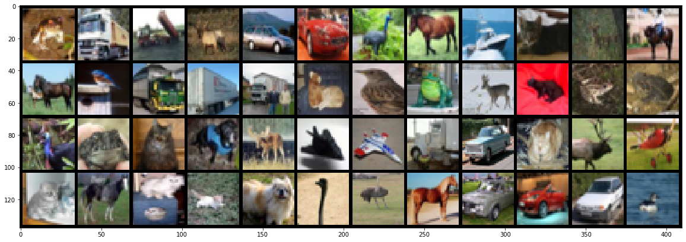

[](https://dataflowr.github.io/website/)

# Module 2: PyTorch tensors and automatic differentiation

[Video timestamp](https://youtu.be/BmAS8IH7n3c?t=103)


```python
import matplotlib.pyplot as plt
%matplotlib inline
import torch
import numpy as np
```


```python
> torch.__version__
```


    '1.12.1+cu113'


Tensors are used to encode the signal to process, but also the internal states and parameters of models.

**Manipulating data through this constrained structure allows to use CPUs and GPUs at peak performance.**

Construct a 3x5 matrix, uninitialized:


```python
x = torch.empty(3,5)
print(x.dtype)
print(x)
```

    torch.float32
    tensor([[7.9394e-35, 0.0000e+00, 3.3631e-44, 0.0000e+00,        nan],
            [0.0000e+00, 1.1578e+27, 1.1362e+30, 7.1547e+22, 4.5828e+30],
            [1.2121e+04, 7.1846e+22, 9.2198e-39, 7.0374e+22, 0.0000e+00]])


If you got an error this [stackoverflow link](https://stackoverflow.com/questions/50617917/overflow-when-unpacking-long-pytorch) might be useful...


```python
x = torch.randn(3,5)
print(x)
```

    tensor([[-0.0515,  0.6647,  0.5428,  2.5307,  0.9185],
            [-0.2556,  0.5543,  1.6044,  0.8425, -1.0667],
            [-0.5247,  0.2197,  0.8738,  0.8047,  0.7197]])


```python
print(x.size())
```

    torch.Size([3, 5])


torch.Size is in fact a [tuple](https://docs.python.org/3/tutorial/datastructures.html#tuples-and-sequences), so it supports the same operations.

[Video timestamp](https://youtu.be/BmAS8IH7n3c?t=272)


```python
x.size()[1]
```


    5


```python
x.size() == (3,5)
```


    True


### Bridge to numpy

[Video timestamp](https://youtu.be/BmAS8IH7n3c?t=325)


```python
y = x.numpy()
print(y)
```

    [[-0.05147836  0.6646777   0.54277486  2.5307057   0.9185137 ]
     [-0.25555766  0.55434686  1.6044122   0.8425406  -1.0667061 ]
     [-0.52467006  0.21967238  0.87380797  0.8046722   0.7197009 ]]


```python
a = np.ones(5)
b = torch.from_numpy(a)
print(a.dtype)
print(b)
```

    float64
    tensor([1., 1., 1., 1., 1.], dtype=torch.float64)


```python
c = b.long()
print(c.dtype, c)
print(b.dtype, b)
```

    torch.int64 tensor([1, 1, 1, 1, 1])
    torch.float64 tensor([1., 1., 1., 1., 1.], dtype=torch.float64)


```python
xr = torch.randn(3, 5)
print(xr.dtype, xr)
```

    torch.float32 tensor([[ 0.4959, -0.8126, -0.7801,  0.9866,  0.5365],
            [-0.9082,  0.1658, -1.2888, -2.4009,  0.5765],
            [-0.4390, -0.6147, -1.3412, -0.0609, -1.0023]])


```python
resb = xr + b
resb
```


    tensor([[ 1.4959,  0.1874,  0.2199,  1.9866,  1.5365],
            [ 0.0918,  1.1658, -0.2888, -1.4009,  1.5765],
            [ 0.5610,  0.3853, -0.3412,  0.9391, -0.0023]], dtype=torch.float64)


```python
resc = xr + c
resc
```


    tensor([[ 1.4959,  0.1874,  0.2199,  1.9866,  1.5365],
            [ 0.0918,  1.1658, -0.2888, -1.4009,  1.5765],
            [ 0.5610,  0.3853, -0.3412,  0.9391, -0.0023]])


Be careful with types!


```python
resb == resc
```


    tensor([[False,  True,  True, False,  True],
            [ True, False,  True,  True, False],
            [False,  True,  True, False,  True]])


```python
torch.set_printoptions(precision=10)
```


```python
resb[0,1]
```


    tensor(0.1874370575, dtype=torch.float64)


```python
resc[0,1]
```


    tensor(0.1874370575)


```python
resc[0,1].dtype
```


    torch.float32


```python
xr[0,1]
```


    tensor(-0.8125629425)


```python
torch.set_printoptions(precision=4)
```

### [Broadcasting](https://docs.scipy.org/doc/numpy-1.13.0/user/basics.broadcasting.html)

[Video timestamp](https://youtu.be/BmAS8IH7n3c?t=670)

Broadcasting automagically expands dimensions by replicating coefficients, when it is necessary to perform operations.

1. If one of the tensors has fewer dimensions than the other, it is reshaped by adding as many dimensions of size 1 as necessary in the front; then
2. for every mismatch, if one of the two tensor is of size one, it is expanded along this axis by replicating  coefficients.

If there is a tensor size mismatch for one of the dimension and neither of them is one, the operation fails.


```python
A = torch.tensor([[1.], [2.], [3.], [4.]])
print(A.size())
B = torch.tensor([[5., -5., 5., -5., 5.]])
print(B.size())
C = A + B
```

    torch.Size([4, 1])
    torch.Size([1, 5])


```python
C
```


    tensor([[ 6., -4.,  6., -4.,  6.],
            [ 7., -3.,  7., -3.,  7.],
            [ 8., -2.,  8., -2.,  8.],
            [ 9., -1.,  9., -1.,  9.]])


### In-place modification

[Video timestamp](https://youtu.be/BmAS8IH7n3c?t=875)


```python
x
```


    tensor([[-0.0515,  0.6647,  0.5428,  2.5307,  0.9185],
            [-0.2556,  0.5543,  1.6044,  0.8425, -1.0667],
            [-0.5247,  0.2197,  0.8738,  0.8047,  0.7197]])


```python
xr
```


    tensor([[ 0.4959, -0.8126, -0.7801,  0.9866,  0.5365],
            [-0.9082,  0.1658, -1.2888, -2.4009,  0.5765],
            [-0.4390, -0.6147, -1.3412, -0.0609, -1.0023]])


```python
print(x+xr)
```

    tensor([[ 0.4444, -0.1479, -0.2373,  3.5173,  1.4550],
            [-1.1637,  0.7201,  0.3156, -1.5584, -0.4903],
            [-0.9636, -0.3950, -0.4674,  0.7438, -0.2826]])


```python
x.add_(xr)
print(x)
```

    tensor([[ 0.4444, -0.1479, -0.2373,  3.5173,  1.4550],
            [-1.1637,  0.7201,  0.3156, -1.5584, -0.4903],
            [-0.9636, -0.3950, -0.4674,  0.7438, -0.2826]])


Any operation that mutates a tensor in-place is post-fixed with an `_`

For example: `x.fill_(y)`, `x.t_()`, will change `x`.


```python
print(x.t())
```

    tensor([[ 0.4444, -1.1637, -0.9636],
            [-0.1479,  0.7201, -0.3950],
            [-0.2373,  0.3156, -0.4674],
            [ 3.5173, -1.5584,  0.7438],
            [ 1.4550, -0.4903, -0.2826]])


```python
x.t_()
print(x)
```

    tensor([[ 0.4444, -1.1637, -0.9636],
            [-0.1479,  0.7201, -0.3950],
            [-0.2373,  0.3156, -0.4674],
            [ 3.5173, -1.5584,  0.7438],
            [ 1.4550, -0.4903, -0.2826]])


### Shared memory

[Video timestamp](https://youtu.be/BmAS8IH7n3c?t=990)

Also be careful, changing the torch tensor modify the numpy array and vice-versa...

This is explained in the PyTorch documentation [here](https://pytorch.org/docs/stable/torch.html#torch.from_numpy):
The returned tensor by `torch.from_numpy` and ndarray share the same memory. Modifications to the tensor will be reflected in the ndarray and vice versa. 


```python
a = np.ones(5)
b = torch.from_numpy(a)
print(b)
```

    tensor([1., 1., 1., 1., 1.], dtype=torch.float64)


```python
a[2] = 0
print(b)
```

    tensor([1., 1., 0., 1., 1.], dtype=torch.float64)


```python
b[3] = 5
print(a)
```

    [1. 1. 0. 5. 1.]

{{#quiz quiz_21.toml}}

### Cuda

[Video timestamp](https://youtu.be/BmAS8IH7n3c?t=1120)


```python
torch.cuda.is_available()
```


    True


```python
#device = torch.device('cpu')
device = torch.device('cuda') # Uncomment this to run on GPU
```


```python
x.device
```


    device(type='cpu')


```python
# let us run this cell only if CUDA is available
# We will use ``torch.device`` objects to move tensors in and out of GPU
if torch.cuda.is_available():
    y = torch.ones_like(x, device=device)  # directly create a tensor on GPU
    x = x.to(device)                       # or just use strings ``.to("cuda")``
    z = x + y
    print(z,z.type())
    print(z.to("cpu", torch.double))       # ``.to`` can also change dtype together!
```

    tensor([[ 1.4444, -0.1637,  0.0364],
            [ 0.8521,  1.7201,  0.6050],
            [ 0.7627,  1.3156,  0.5326],
            [ 4.5173, -0.5584,  1.7438],
            [ 2.4550,  0.5097,  0.7174]], device='cuda:0') torch.cuda.FloatTensor
    tensor([[ 1.4444, -0.1637,  0.0364],
            [ 0.8521,  1.7201,  0.6050],
            [ 0.7627,  1.3156,  0.5326],
            [ 4.5173, -0.5584,  1.7438],
            [ 2.4550,  0.5097,  0.7174]], dtype=torch.float64)


```python
x = torch.randn(1)
x = x.to(device)
```


```python
x.device
```


    device(type='cuda', index=0)


```python
# the following line is only useful if CUDA is available
x = x.data
print(x)
print(x.item())
print(x.cpu().numpy())
```

    tensor([-0.8821], device='cuda:0')
    -0.8821402192115784
    [-0.8821402]

{{#quiz quiz_22.toml}}

# Simple interfaces to standard image data-bases

[Video timestamp](https://youtu.be/BmAS8IH7n3c?t=1354)

An example, the [CIFAR10](https://pytorch.org/docs/stable/torchvision/datasets.html#torchvision.datasets.CIFAR10) dataset.


```python
import torchvision

data_dir = 'content/data'

cifar = torchvision.datasets.CIFAR10(data_dir, train = True, download = True)
cifar.data.shape
```

    Downloading https://www.cs.toronto.edu/~kriz/cifar-10-python.tar.gz to content/data/cifar-10-python.tar.gz


      0%|          | 0/170498071 [00:00<?, ?it/s]


    Extracting content/data/cifar-10-python.tar.gz to content/data


    (50000, 32, 32, 3)


Documentation about the [`permute`](https://pytorch.org/docs/stable/tensors.html#torch.Tensor.permute) operation.


```python
x = torch.from_numpy(cifar.data).permute(0,3,1,2).float()
x = x / 255
print(x.type(), x.size(), x.min().item(), x.max().item())
```

    torch.FloatTensor torch.Size([50000, 3, 32, 32]) 0.0 1.0


Documentation about the [`narrow(input, dim, start, length)`](https://pytorch.org/docs/stable/torch.html#torch.narrow) operation.


```python
# Narrows to the first images, converts to float
x = torch.narrow(x, 0, 0, 48)
```


```python
x.shape
```


    torch.Size([48, 3, 32, 32])


```python
# Showing images
def show(img):
    npimg = img.numpy()
    plt.figure(figsize=(20,10))
    plt.imshow(np.transpose(npimg, (1,2,0)), interpolation='nearest')
    
show(torchvision.utils.make_grid(x, nrow = 12))
```


    

    


```python
# Kills the green and blue channels
x.narrow(1, 1, 2).fill_(0)
show(torchvision.utils.make_grid(x, nrow = 12))
```


    

    


# Autograd: automatic differentiation

[Video timestamp](https://youtu.be/Z6H3zakmn6E?t=40)

When executing tensor operations, PyTorch can automatically construct on-the-fly the graph of operations to compute the gradient of any quantity with respect to any tensor involved.

To be more concrete, we introduce the following example: we consider parameters $w\in \mathbb{R}$ and $b\in \mathbb{R}$ with the corresponding function:
\begin{eqnarray*}
\ell = \left(\exp(wx+b) - y^* \right)^2
\end{eqnarray*}

Our goal here, will be to compute the following partial derivatives:
\begin{eqnarray*}
\frac{\partial \ell}{\partial w}\mbox{ and, }\frac{\partial \ell}{\partial b}.
\end{eqnarray*}

The reason for doing this will be clear when you will solve the practicals for this lesson!

You can decompose this function as a composition of basic operations. This is call the forward pass on the graph of operations.


Let say we start with our model in `numpy`:


```python
w = np.array([0.5])
b = np.array([2])
xx = np.array([0.5])#np.arange(0,1.5,.5)
```

transform these into `tensor`:


```python
xx_t = torch.from_numpy(xx)
w_t = torch.from_numpy(w)
b_t = torch.from_numpy(b)
```

[Video timestamp](https://youtu.be/Z6H3zakmn6E?t=224)

A `tensor` has a Boolean field `requires_grad`, set to `False` by default, which states if PyTorch should build the graph of operations so that gradients with respect to it can be computed.


```python
w_t.requires_grad
```


    False


We want to take derivative with respect to $w$ so we change this value:


```python
w_t.requires_grad_(True)
```


    tensor([0.5000], dtype=torch.float64, requires_grad=True)


We want to do the same thing for $b$ but the following line will produce an error!


```python
b_t.requires_grad_(True)
```


    ---------------------------------------------------------------------------

    RuntimeError                              Traceback (most recent call last)

    <ipython-input-49-68842c726fce> in <module>
    ----> 1 b_t.requires_grad_(True)
    

    RuntimeError: only Tensors of floating point dtype can require gradients


Reading the error message should allow you to correct the mistake!


```python
dtype = torch.float64
```


```python
b_t = b_t.type(dtype)
```


```python
b_t.requires_grad_(True)
```


    tensor([2.], dtype=torch.float64, requires_grad=True)


[Video timestamp](https://youtu.be/Z6H3zakmn6E?t=404)

We now compute the function:


```python
def fun(x,ystar):
    y = torch.exp(w_t*x+b_t)
    print(y)
    return torch.sum((y-ystar)**2)

ystar_t = torch.randn_like(xx_t)
l_t = fun(xx_t,ystar_t)
```

    tensor([9.4877], dtype=torch.float64, grad_fn=<ExpBackward0>)


```python
l_t
```


    tensor(89.3094, dtype=torch.float64, grad_fn=<SumBackward0>)


```python
l_t.requires_grad
```


    True


After the computation is finished, i.e. *forward pass*, you can call `.backward()` and have all the gradients computed automatically.


```python
print(w_t.grad)
```

    None


```python
l_t.backward()
```


```python
print(w_t.grad)
print(b_t.grad)
```

    tensor([89.6626], dtype=torch.float64)
    tensor([179.3251], dtype=torch.float64)


[Video timestamp](https://youtu.be/Z6H3zakmn6E?t=545)

Let's try to understand these numbers...


```python
yy_t = torch.exp(w_t*xx_t+b_t)
print(torch.sum(2*(yy_t-ystar_t)*yy_t*xx_t))
print(torch.sum(2*(yy_t-ystar_t)*yy_t))
```

    tensor(89.6626, dtype=torch.float64, grad_fn=<SumBackward0>)
    tensor(179.3251, dtype=torch.float64, grad_fn=<SumBackward0>)


`tensor.backward()` accumulates the gradients in  the `grad` fields  of tensors.


```python
l_t = fun(xx_t,ystar_t)
l_t.backward()
```

    tensor([9.4877], dtype=torch.float64, grad_fn=<ExpBackward0>)


```python
print(w_t.grad)
print(b_t.grad)
```

    tensor([179.3251], dtype=torch.float64)
    tensor([358.6502], dtype=torch.float64)


By default, `backward` deletes the computational graph when it is used so that you will get an error below:


```python
l_t.backward()
```


    ---------------------------------------------------------------------------

    RuntimeError                              Traceback (most recent call last)

    <ipython-input-62-e295af15a710> in <module>
    ----> 1 l_t.backward()
    

    /usr/local/lib/python3.7/dist-packages/torch/_tensor.py in backward(self, gradient, retain_graph, create_graph, inputs)
        394                 create_graph=create_graph,
        395                 inputs=inputs)
    --> 396         torch.autograd.backward(self, gradient, retain_graph, create_graph, inputs=inputs)
        397 
        398     def register_hook(self, hook):


    /usr/local/lib/python3.7/dist-packages/torch/autograd/__init__.py in backward(tensors, grad_tensors, retain_graph, create_graph, grad_variables, inputs)
        173     Variable._execution_engine.run_backward(  # Calls into the C++ engine to run the backward pass
        174         tensors, grad_tensors_, retain_graph, create_graph, inputs,
    --> 175         allow_unreachable=True, accumulate_grad=True)  # Calls into the C++ engine to run the backward pass
        176 
        177 def grad(


    RuntimeError: Trying to backward through the graph a second time (or directly access saved tensors after they have already been freed). Saved intermediate values of the graph are freed when you call .backward() or autograd.grad(). Specify retain_graph=True if you need to backward through the graph a second time or if you need to access saved tensors after calling backward.


```python
# Manually zero the gradients
w_t.grad.data.zero_()
b_t.grad.data.zero_()
l_t = fun(xx_t,ystar_t)
l_t.backward(retain_graph=True)
l_t.backward()
print(w_t.grad)
print(b_t.grad)
```

    tensor([9.4877], dtype=torch.float64, grad_fn=<ExpBackward0>)
    tensor([179.3251], dtype=torch.float64)
    tensor([358.6502], dtype=torch.float64)


The gradients must be set to zero manually. Otherwise they will cumulate across several _.backward()_ calls. 
This accumulating behavior is desirable in particular to compute the gradient of a loss summed over several “mini-batches,” or the gradient of a sum of losses.

{{#quiz quiz_23.toml}}

[](https://dataflowr.github.io/website/)


```python

```
